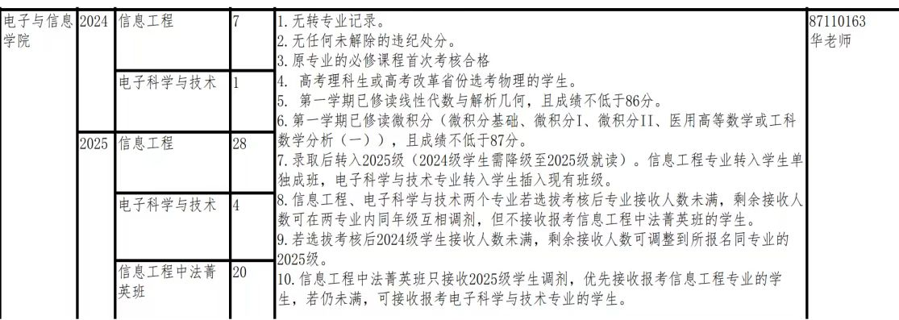

# Transfer to Information Engineering Experience — 十七 (Materials Science → Information Engineering)

## Introduction

In terms of majors, SCUT's School of Electronic and Information Engineering has two programs: Information Engineering (信工) and Electronic Science and Technology (电科). There are slight differences in coursework — E-Science leans more toward RF and antennas; other courses are more or less the same. Note that Information Engineering has historically been formed as a dedicated transfer class, while E-Science students are inserted into existing classes. Consider the pros and cons of each before deciding which major to transfer into.

Overall, transferring into the School of Electronic and Information Engineering is not as difficult as imagined. In recent years, students with an average score around the 15th percentile have successfully transferred in — there is no extreme emphasis on high GPA. Students without very high GPA can make up for it through the written exam and interview, so the tolerance is relatively high. Of course, you do need to look at the applicant-to-acceptance ratio for that year — the lower the ratio, the higher the forgiveness rate. In the 2025 cohort, the success rate was close to 70%, with the elimination rate being the lowest in years. The author didn't meet the calculus threshold required by Mechanical Engineering but still successfully transferred into Information Engineering. (How? Well, I totally slacked off in the first semester.)

## Transfer Requirements and Process

Policy explanation: The School of Electronic and Information Engineering has a reassignment option. In the 2025 cohort, Information Engineering filled up while E-Science did not — some Information Engineering applicants were reassigned to Electronic Science and Technology (the bottom two by composite score were moved to E-Science, and a teacher would contact you to ask if you're willing). The math threshold is relatively fixed and not very high — a senior mentioned that the school uses a 50th percentile single-subject cutoff as a reference line. The school always uses up all allocated slots; the number of admits is fixed — there's no such thing as not filling the quota.

For example, I'm in the 2025 cohort. If the 2024 cohort's Information Engineering had 7 slots and only 2 people applied, the 5 unused slots would roll down to 2025 cohort students. Don't just look at your own cohort's applicant-to-acceptance ratio — the actual ratio is lower (slots roll down from the previous cohort). Pay careful attention to Article 9 of the transfer requirements on this point. The 2025 Sino-French class was canceled on the last day of registration because too few people signed up — not sure if the 2026 cohort will be able to form the class (it depends on reaching the minimum enrollment count). The Sino-French class involves studying abroad and French language courses but has no postgraduate recommendation eligibility, so few people are interested.

In late April of the second semester of freshman year, the transfer thresholds and written exam content are announced. The Information Engineering and E-Science exams are held together with the same scope. The physics section is 40 points (this course only starts in the second semester — most freshmen don't have it in the first semester), and Advanced Math + Linear Algebra is 60 points. If you're considering transferring to the School of Electronic and Information Engineering, start preparing as soon as the thresholds and exam scope are out — don't party too hard during the May Day holiday.

## Written Exam and Interview

The written exam takes place around early May (after May Day, roughly May 7). The interview shortlist comes out about two days after the written exam, and the final admission list comes out one to two days after the interview. A fairly complete set of past questions is available in the Information Engineering transfer group (compiled by other seniors). The exam time is very tight — 11 fill-in-the-blank math questions, 6 long-answer math questions. The linear algebra section was especially difficult, with about one and a half proof questions. College Physics was roughly 10 fill-in-the-blank + 10 multiple choice. Altogether it's two hours with a massive question volume — you need to write fast. You can find the questions in the group; some questions repeat from last year and previous years. (The group number is given at the end — you can join as late as the second semester once you've decided to transfer.)

## Interview Criteria and Teacher Questions

The evaluation criteria are roughly as follows:

1. **GPA** — relates to learning ability. Even if you're from an unrelated major, your average score should ideally look good. This is a major criterion teachers use to judge your learning ability — teachers don't have time to scrutinize every course, they can only glance. The higher your average, the better your advantage. Pay careful attention to the credit weight and assessment requirements of each course — don't just go by gut feeling. Some filler courses carry a lot of weight, which matters quite a bit if you want to transfer. Don't let your ideological/political courses drop too low — you can afford to acknowledge them.
2. **English Proficiency**
3. **Research and Competition Potential** — competition experience and project practice will give you a substantial advantage
4. **Demonstrated Psychological Qualities**

Questions are fairly random. By the time of our interview, the admission slots were already essentially set after the written exam, so teachers were more focused on just having a conversation. The interview consists of a 3-minute self-introduction and 4 minutes of teacher questions. You cannot use electronic devices while waiting — they'll be collected, and you can take your phone and leave after your interview. Generally, questions are based on your self-introduction, so if you're unsure about something or stretching the truth, be careful — teachers may probe further on something that catches their interest. They'll also ask major-related questions, such as what you've done to prepare for transferring into Information Engineering, whether you have any related competitions or hands-on projects — this tests your potential. It's recommended to prepare a bit more in this area.

I recall one teacher who taught the Introduction to AI course asked me about AI-related online course content, but I had just breezed through it all and didn't know anything — I made stuff up. Another teacher asked about club activities.

## Summary

Transferring into Information Engineering is not as hard as it seems, but definitely don't take it lightly. The most important thing is to have a decent average score in your first semester and score well in math and English. That's about it. If you have more questions, join the Information Engineering transfer group and ask: 1037507331
