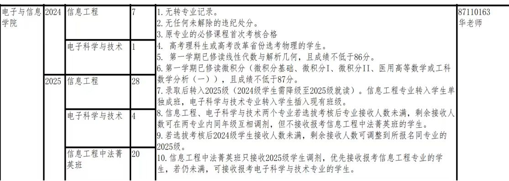

# Experience Sharing: Transferring into Information Engineering — 十七 (Materials to Information Engineering)

## Introduction

In terms of majors, SCUT's School of Electronic and Information Engineering offers two programs: Information Engineering, and Electronic Science and Technology. The curricula differ slightly — Electronic Science and Technology leans a bit more toward RF and antennas, while the rest of the courses are largely the same. Note that in past years, Information Engineering was organized as a dedicated class of transfer students, while Electronic Science and Technology students were inserted into existing classes. Weigh the pros and cons of the two yourself when deciding which one you want to transfer into.

Overall, transferring into the School of Electronic and Information Engineering is not as hard as you might imagine. In recent years, students with averages around the 15th percentile have transferred in successfully, and there is no particular emphasis on a high GPA. Students without very high GPAs can turn things around through the written exam and interview — it is relatively forgiving. Of course, factor in that year's application-to-admission ratio: the lower the ratio, the higher your margin for error. For the class of 2025, the success rate was close to 70%, the lowest elimination rate in years. My own calculus grade did not meet Mechanical Engineering's hard threshold, yet I still successfully transferred into Information Engineering. (Why? Let's just say I completely slacked off in my first semester.)

## Transfer Requirements and Process

A note on transfer policy: the School of Electronic and Information Engineering does have an adjustment option. For the class of 2025, Information Engineering filled up while Electronic Science and Technology did not, so some Information Engineering applicants were reassigned to Electronic Science and Technology (the two lowest comprehensive scores were moved to Electronic Science and Technology; a teacher will contact you at the time to ask whether you are willing to go). The math threshold is fairly fixed and not particularly high — one senior said the school sets it at 50% of the per-subject average, with that cutoff line serving as the reference standard. All of the slots the school offers do get used; the number admitted is fixed, and it never ends up under-filled.

For example, I am from the class of 2025. If Information Engineering had 7 slots for the class of 2024 and only 2 people applied, the 5 unused slots would be passed down to class-of-2025 students. Do not look only at the application-to-admission ratio within your own cohort — the real ratio is somewhat lower (slots are handed down from the cohort above). You can check item 9 of the transfer requirements for this detail. As for the class-of-2025 Sino-French class, it was canceled because too few people applied — everyone was notified on the final day of registration. Whether it can be formed for the class of 2026 is unknown (the precondition is that enough people sign up). The Sino-French class goes abroad for study tours and takes French courses, but it carries no graduate recommendation (baoyan) eligibility, so not many people want to join it.

In late April of the second semester of freshman year, the transfer thresholds and the written exam content are announced. Information Engineering and Electronic Science and Technology hold their exams together with the same scope: the physics portion is worth 40 points (University Physics is only offered in the second semester, so first-semester students generally have not taken it yet), and Advanced Mathematics + Linear Algebra are worth 60 points. If you are considering transferring into this school, you can start preparing as soon as the thresholds and exam scope come out. Cut back on the fun during the May Day holiday, okay?

## The Written Exam and Interview

The written exam takes place in early May (after the May Day holiday, around May 7). About two days after the exam, the interview list comes out, and the final admission list follows one or two days after the interviews. Fairly complete compilations of the questions (put together by other seniors) circulate in the Information Engineering transfer group chat. The exam time is very tight: 11 short math questions and 6 long math problems, with the Linear Algebra portion being quite difficult — about one and a half proof questions. University Physics was something like 10 fill-in-the-blank and 10 multiple-choice. Two hours in total, a huge volume of questions, so write quickly. You can find the questions in the group chat; last year's overlapped in part with earlier years. (The group number is given at the end — even if you only make up your mind about transferring in the second semester, joining then is still soon enough.)

## Interview Criteria and Questions from the Teachers

The evaluation criteria are roughly as follows:

1. **GPA**, which is tied to learning ability. Even if you come from an unrelated major, your average should look decent — it is a major yardstick the teachers use to judge your learning ability. Teachers do not have the time to go through your transcript course by course; they can only glance over it, so the higher your average, the better your odds. Be sure to check each course's credits and assessment requirements carefully rather than going by your own assumptions — some low-effort courses carry a lot of weight, which matters quite a bit if you want to transfer. Do not let your ideological and political theory course grades fall too low; those can still be brought back up.
2. **English proficiency**
3. **Research and competition potential** — prior competition experience or project practice gives you a significant advantage
4. **Composure during the interview**

The questions themselves are fairly random. In our case, the admission slots had already been settled once the written exam ended, so the teachers leaned more toward just chatting with the students. Each interview was a three-minute self-introduction followed by four minutes of questions from the teachers. You may not use electronic devices while waiting for your interview — they are collected — and you get your phone back when you are done. The questions are generally based on your self-introduction, so if there is anything you are unsure about or made up, be careful: the teacher may dig into whatever part catches their interest. They will also ask some major-related questions, such as what you have done to prepare for transferring into Information Engineering and whether you have related competitions or practical experience, to gauge your potential. It is worth preparing a little extra on this front.

I remember one of the teachers taught Introduction to Artificial Intelligence, and she asked about the AI online course — I had just blazed through the videos without actually learning anything, so I improvised. Another teacher asked about student clubs.

## Summary

Transferring into Information Engineering is not as hard as it seems, but do not let your guard down. What matters most is making your first-semester average look good and scoring high in math and English. That is about it — if anything is still unclear, join the Information Engineering transfer group and ask: 1037507331
