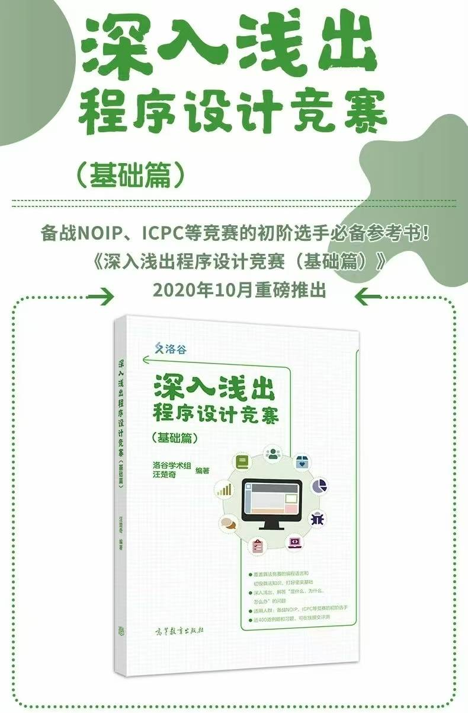
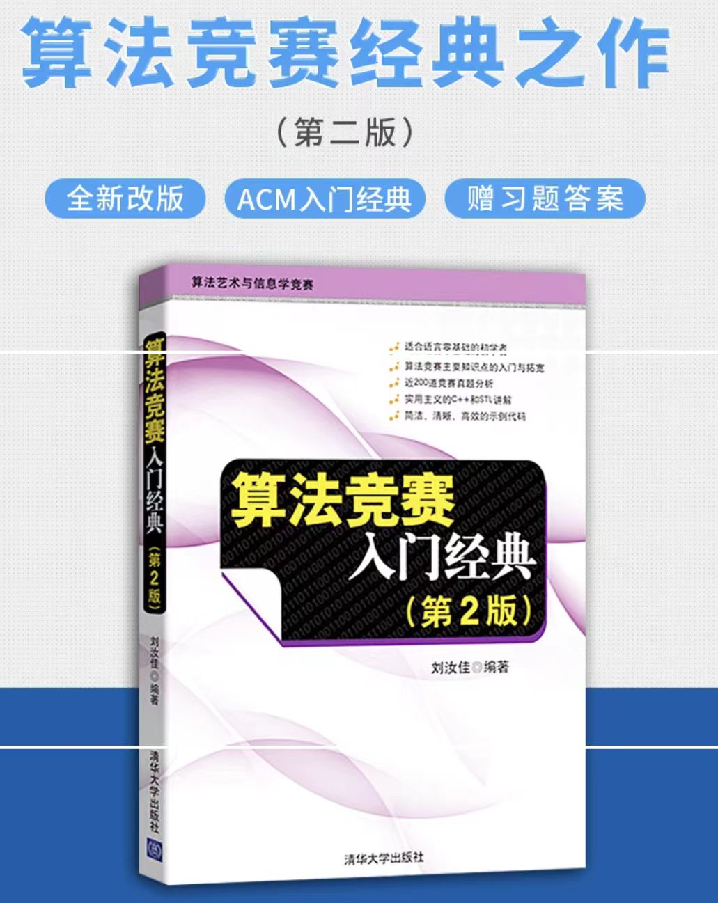

# ACM Competition Introduction

## Overview

**Organizer: Association for Computing Machinery (ACM)**

The ACM International Collegiate Programming Contest (abbreviated as **ACM-ICPC**) is one of the most influential university-level algorithm competitions worldwide. The competition is team-based, with each team consisting of three members, testing participants' skills in algorithm design, programming ability, and teamwork.

The SCUT ACM Training Team organizes and selects outstanding students on campus to participate in various competitions, including:

- **ICPC (International Collegiate Programming Contest)**
- **CCPC (China Collegiate Programming Contest)**
- **GDCPC (Guangdong Collegiate Programming Contest)**
- **Joint inter-university contests with SCUT's neighboring schools (GDUT, GZHU, SCNU, JNU, etc.)**
- **Lanqiao Cup, corporate-sponsored competitions, etc.**

---

## ACM Competition Rules Overview

### Competition Format

- **Three people per team**
- **Only the team leader's computer can submit code**
- The other two members can only read problems and discuss ideas
- **Duration: 5 hours**
- **Number of problems: 7 to 12**
- **Printed reference materials are allowed**
- **Common languages: C++, Java, Python (C++ recommended for speed)**
- **Problem statements are entirely in English**

Generally, ACM-related competition problems consist of the following sections:

- **Time Limit**
- **Memory Limit**
- **Description**
- **Input**
- **Output**
- **Sample Input/Output**

Submitted code can result in the following verdicts:

| Abbreviation | Full Name             | Meaning               |
| ------------ | --------------------- | --------------------- |
| AC           | Accept                | Accepted              |
| WA           | Wrong Answer          | Wrong answer          |
| CE           | Compile Error         | Compilation error     |
| TLE          | Time Limit Exceeded   | Time limit exceeded   |
| MLE          | Memory Limit Exceeded | Memory limit exceeded |
| PE           | Presentation Error    | Format error          |

> ⚠️ Only **AC** means the problem is solved; all other verdicts indicate an issue with the code.

### Scoring Mechanism

- **Primary ranking: number of problems solved** — the more, the higher the rank
- **Secondary ranking: total time** — total time = ∑(time of correct submission + penalty)
  - Each incorrect submission (except CE) adds a 20-minute penalty
  - Penalty is only counted for problems that are eventually solved
- **Freeze mechanism**: The scoreboard freezes 1 hour before the end, with final results revealed after the contest (may involve “scoreboard rolling”)

### Reward Mechanism

- Balloons are awarded for solving problems
- The first team to solve a problem receives a special balloon

---

## Training Team Selection and Training Plan

### 1. Recruitment Period

- **Only one recruitment opportunity per year**, typically at the beginning of the academic year.
- Missing it means waiting until next year — start preparing early!

### 2. Training Schedule

- **Regular training**: 5-hour sessions every weekend (simulating actual contest duration)
- **Winter and summer break training**:
  - **Winter break**: Senior students teach basic algorithm knowledge
  - **Summer break**: Participate in national joint training camps

### 3. Competition Participation

- Main target competitions are **ICPC** and **CCPC**
- Qualify for regional rounds through online contests in the first semester
- Outstanding performers can advance to **EC-Final** or **CCPC Final**
- Other recommended competitions include Lanqiao Cup and corporate-sponsored contests — opportunities for prize money and comprehensive evaluation bonus points

---

## Registration and Timeline

### Registration Channels

- **On-campus selection**: Join the training team through the SCUT ACM campus competition

### Competition Schedule

| Competition | Timing                                             |
| ----------- | -------------------------------------------------- |
| ICPC / CCPC | Usually held in the fall semester                  |
| GDCPC       | Provincial competition, usually in spring semester |
| Lanqiao Cup | Preliminary in spring, finals in summer            |

---

## Advantages of Joining the Training Team

- **Rich learning resources**: One-on-one Q&A with experienced seniors, covering academics and daily life
- **Networking opportunities**: Meet like-minded teammates, beneficial for future projects or job hunting
- **Practical experience**: Winter and summer break training counts as social practice
- **Comprehensive evaluation bonus**: Awards earn intellectual development points
- **Graduate recommendation edge**: Strong competition performance means better coding skills in graduate school interviews, especially helpful for computer-related majors. _(Note: Specific policies vary by school)_
- **Career advantages**: Winning corporate-sponsored competitions can lead directly to internships or job offers at well-known companies. Solid algorithm foundations and hands-on experience give you an edge in technical interviews. Plus, employed seniors can provide internal referrals, significantly improving job search success.
- **Research boost**: Lab professors prefer students with competition backgrounds

---

## Getting Started for Newcomers

### Choosing a Programming Language

- **C++ is recommended**: Fast, well-suited for algorithm competitions
- Python / Java, due to interpreted language characteristics, are prone to timeouts and only suitable for a few big-number problems

### Development Environment Suggestions

- **Windows**:
  - Beginners: Use **Code::Blocks** or **Dev-C++**
  - Advanced users: Use **VSCode + MinGW / WSL + GNU G++**
- **Linux users**: Configure as you like
- **Mac users**: Try VSCode + Clang compiler

### Recommended Learning Resources

- **C++ Quick Start**: [Runoob - C++ Tutorial](https://www.runoob.com/cplusplus/cpp-tutorial.html)
- **OI Wiki**: [OI-Wiki](https://oi-wiki.org/)
- **Practice Platforms**:
  - [Luogu](https://www.luogu.com.cn/)
  - [LeetCode](https://leetcode.cn/problemset/all/)
  - [Codeforces](https://codeforces.com/)
- **Algorithm Templates**:
  - [jiangly Algorithm Template Collection - hh2048 - cnblogs](https://www.cnblogs.com/WIDA/p/17633758.html)

### Beginner Learning Path

1. Learn basic syntax (recommended: “Programming Contests: From Entry to Mastery”)
2. Master fundamental algorithms:
   - Binary search
   - Greedy algorithms
   - Dynamic programming (DP)
   - Search (DFS/BFS)
3. Improve English reading comprehension (all problem statements are in English)

---

## Preparation Strategy (For New Students)

### Quick Start Roadmap

1. **Master C++ basics**:
   - Data types, loops, function definitions, arrays, and string operations
2. **Get familiar with the STL**:
   - Common containers like `vector`, `map`, `set`, `priority_queue`
3. **Practice to gain experience**:
   - Start with easy problems, gradually move to medium difficulty
4. **Simulate real contests**:
   - Participate in a 5-hour mock contest weekly to get used to the rhythm

### Recommended Books

- “Programming Contests: From Entry to Mastery” (Published by Luogu)
- “Introduction to Algorithm Contests” (by Liu Rujia)
  

### Areas for Improvement

- **English problem reading skills**: Practice with original problem statements
- **Debugging skills**: Learn to use debugging tools
- **Time management**: Allocate problem-solving time wisely to avoid getting stuck

---

## Conclusion

Joining the ACM Training Team is not only an excellent opportunity to sharpen your programming skills and logical thinking, but also a significant springboard to higher academic platforms and quality career opportunities. As long as you are willing to invest time and effort and have the courage to challenge yourself, you have the chance to stand out and become a member of the SCUT ACM team!

**2025 SCUT ACM Training Team Recruitment QQ Group**: 557553053
