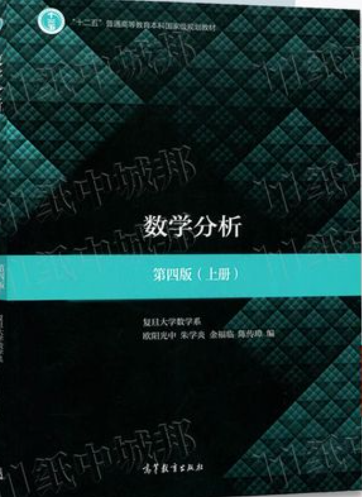
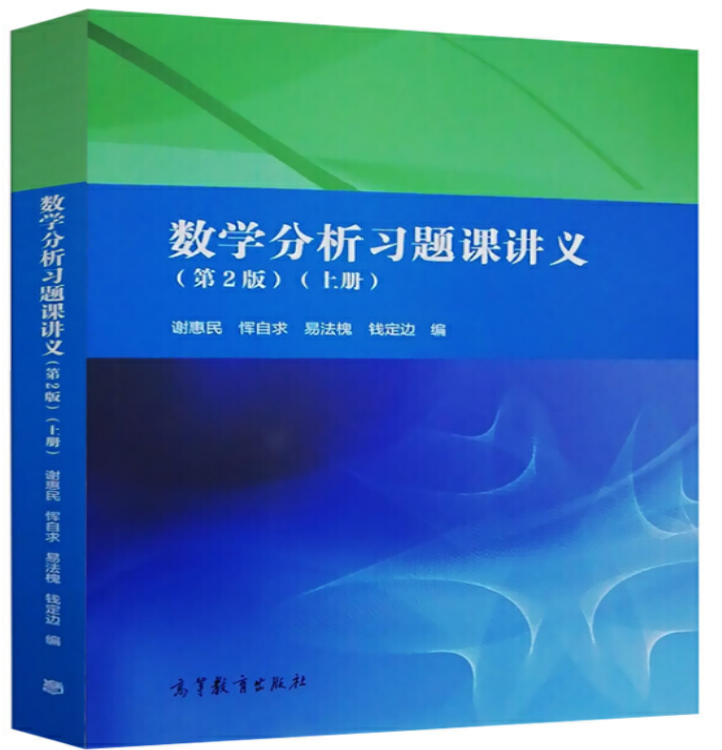
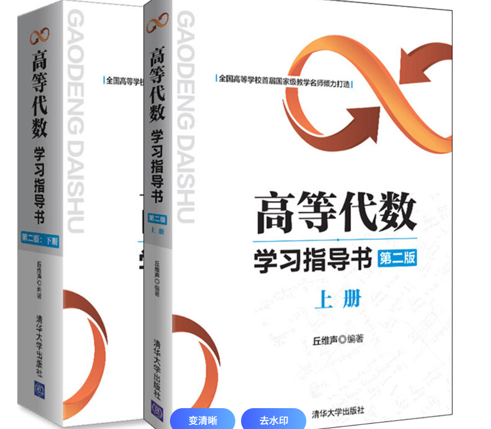
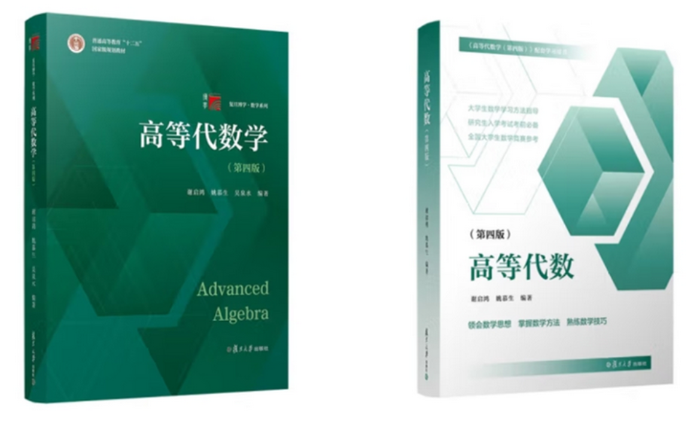
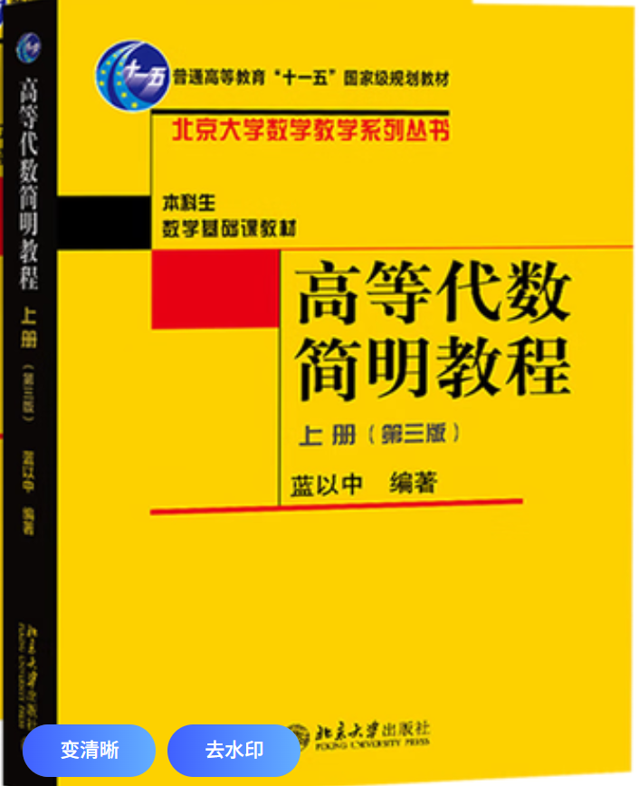
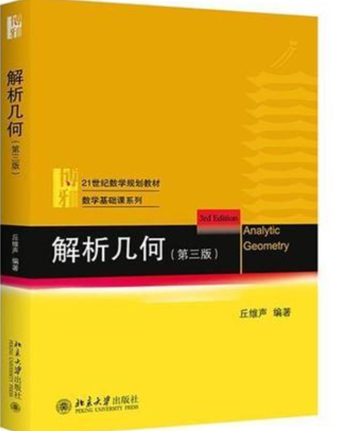

# 华南理工大学数学系学生 大一自救指南

编者：薛定谔的大马丁

本文面向全体华南理工大学数学系大一学生，重点介绍数分和高代两门课的学习和考试经验

## 上课学习篇
初次来到数学系，建议你先不要开启自学模式，除非你对自己的自学能力十分自信。

**建议前一周的课都认真听课**，认真听老师讲下数学分析和高等代数的基本概念，尽管有些知识是考的概率很低的，比如数学分析中的**实数的完备性定理**。当然，前面的几节课中也有不少知识点是十分重要的，以下举两个例子：

**1. 极限的 $ \varepsilon $ ,$ \delta $ 语言**

**2. 线性相关和线性无关**

## 数学分析篇

### 基础的数分学习
数学分析本校采用的课本是由复旦大学欧阳光中等人所著的数学分析第四版，图书的纸质封面如下图所示。（当然如果不一样，以你们老师讲的为主）

知识点的讲解路径和课本基本一致，当然有些老师可能会使用卓里奇数学分析教材第七版（是俄罗斯人写的教材，难度非常大）。

数学分析的学习推荐跟着老师听课学习，当然如果你觉得老师讲的慢，可以自己上b站搜索网课，陈纪修（节奏较慢），史济怀（节奏较快），总有一款老师的网课适合你

### 进阶的数分学习
本人推荐使用谢惠民的数学分析习题集进行进阶的数分练习，这本书讲的内容很深，扩展的部分也较多。实体书封面如下图所示

 

温馨提示：这本书只有每一章的参考题部分有答案，每一节后面的练习题答案要自己搜，这里提供两个获取答案的方案，b站up主**aceaccce**，和b站up主**分析学爱好者**均有谢惠民习题集的解答。

当然诸如裴礼文数学分析习题集和吉米多维奇数学分析习题集也是非常优秀的习题集，只不过本人最喜欢谢惠民的习题集

## 高等代数篇
**我们学校高等代数的教学质量堪忧 ！**
### 高等代数基础学习
高等代数课本为学校自编讲义（当然如果不一样，以你们老师讲的为主），上册讲解顺序大概是**线性方程组->线性相关与线性无关->矩阵->行列式->线性空间** 下册的讲解顺序不记得了，没怎么听课。

本人的高代基本是自学的个人认为b站上的网课比老师讲的有用。华工的高代槽点在于知识点之间联系讲的不好，讲课顺序混乱

推荐的网课：
1. 丘维声老师的网课，丘维声老师的课较多为证明定理，需要自己课后再做习题，优点是一节课的时间短，20多分钟，并且知识点与知识点的联系紧密，并且听课是基本不需要丘老的配套教材的，记笔记就可以。丘老的网课会将不少我们学校不讲的内容，这个和你们具体的讲课情况对应，可以问授课老师。
2. 谢启鸿老师的的网课，优点是习题讲的会比丘老多，并且谢启鸿老师有配套的习题课。缺点是一节课时间较长，要40多分钟
高代考试考的较为简单，主要是计算题，大一上的行列式计算，过渡矩阵计算，大二的Jordan标准型计算等等。证明题考的比较水。我们学校老师教学会有配套作业，认真做课后作业，再做几套期末试卷就基本可以拿90分。
这两个老师的网课均配有教材

丘老的教材

谢帅的教材

对了，想要快速过掉高代知识点推荐一本书：
 **蓝以中的高等代数简明教程**

### 高等代数拓展学习
 这部分其实没啥好说的，就照着上部分介绍的那两个老师的网课学习就可以，丘老的书里面的题目和定理特别多，可以当练习册用。如果你能把丘老的书刷50%以上，你已经超过数学系95%的学生了。

### 解析几何
解析几何课本用的是丘维声老师的解析几何教材第三版，课程很简单，老师前几节课会告诉你们课程范围，基本就做好课后作业就OK。

教材如图

## 考试篇

**最后一节课强烈推荐去听一下，老师会讲复习课和重要考点。**

### 数分备考

数分可以问学长拿往年卷子，然后如果你们老师有习题课，习题课的ppt要重点复习，还有就是有时间可以刷复旦那本数分的课后习题。**注意：考试很少会考谢惠民习题集上面的题目，备考时慎用这本书**

### 高代备考
高代考试很水，老师会发往年卷子，有多的时间就刷刷丘老师的书上的计算题，太难的证明题可以不用管。

### 解析几何备考
包打听上有往年题目，做做往年题目，再把老师布置的题目做一下，课本的课后习题做一下，基本有90分.

## 推荐两个可以参加的竞赛
丘成桐数学竞赛，全国大学生数学竞赛。
本人只大一参加过全国大学生数学竞赛(CMC)，当时准备了一周，拿了个省三。大学生数学竞赛数学学院学生只能参加数学类A,参加竞赛可以混创新分，参加0.5分，获奖1分。但是不好的是这个比赛报名费要100元。

备赛方面：可以去网上搜索往年题目，CMC数A分为三个板块，6道题目，：15分的解析几何，35分的高代，50分的数分，解析几何一道题，高代2道题，数分3道题，基本做对两道题就有奖，解析几何很简单，一定要拿下。CMC考试时间为3h。
## 最后的一些话
数学学院的学习氛围是没那么好的，以我为例，我的剩下三位室友有两位基本就是在宿舍打游戏，平常就是1点睡觉，早上12点起床开玩。并且数学学院还有很多没有意义的事情，比如这一届就有写什么职业规划书。并且我们学院的纯数学实力是很弱的，尤其是代数和几何，和其他学校比没什么资源。各位想要在数学学院去到更好的地方只能靠自己的努力，希望各位都有美好的未来。

# 电子书下载
可以微信小程序搜索拾壹工具箱，里面基本有你需要的电子书教材