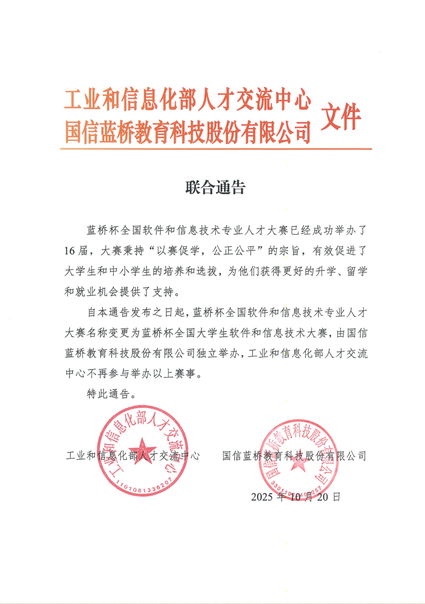

# 竞赛目录及简介

以下是已有编者撰写比赛经验与参赛说明的竞赛。

学术类：

- [中国大学生数学竞赛（CMC）](contest/cmc.md)
- [ACM/ICPC](contest/ACM.md)

技术类：

- [第二十一届鼎甲杯软件设计大赛（软件学院举办）](https://mp.weixin.qq.com/s/AhzhDdbl0COusLIMRNFPkA)

**特注：蓝桥杯系列赛事于2025年10月20日之后，工信部不再参与举办，由国信蓝桥教育科技股份有限公司独立举办[^1]，请审慎评估参加该比赛的收益预期！**

更多的竞赛相关内容，可以查阅：
[2023本科生学科竞赛咨询手册](https://fastgit.cc/https://raw.githubusercontent.com/Kozmosa/survive-in-scut/main/assets/2023%E5%B9%B4%E6%9C%AC%E7%A7%91%E7%94%9F%E5%AD%A6%E7%A7%91%E7%AB%9E%E8%B5%9B%E8%B5%84%E8%AE%AF%E6%89%8B%E5%86%8C-%E5%B7%B2%E5%8E%8B%E7%BC%A9.pdf)

TODO: 需要进一步完善，添加更多竞赛内容的指引

---

[^1]: [蓝桥杯与工信部联合通告](https://dasai.lanqiao.cn/notices/1834/)
