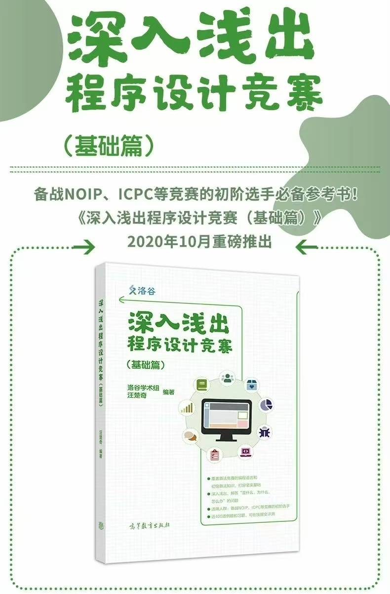
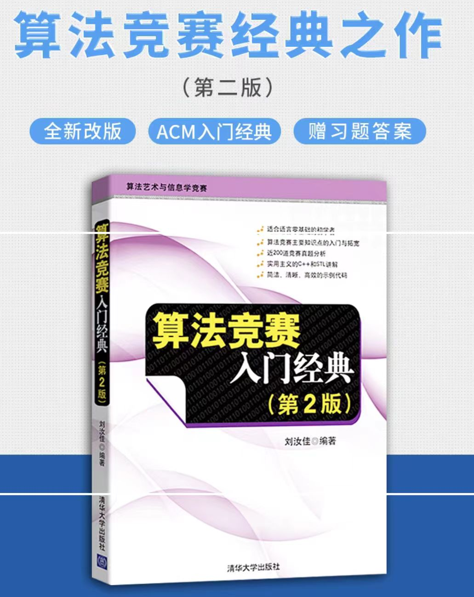

# ACM 竞赛介绍

## 简介

**主办方：国际计算机协会（ACM）**

ACM国际大学生程序设计竞赛（ACM International Collegiate Programming Contest，简称 **ACM-ICPC**），是全球最具影响力的大学生算法竞赛之一。比赛以团队形式进行，每支队伍由三名成员组成，主要考察选手在算法设计、编程能力以及团队协作方面的综合水平。

华南理工大学 ACM 集训队负责组织和选拔校内优秀学生参与各类赛事，包括：

- **ICPC（国际大学生程序设计竞赛）**
- **CCPC（中国大学生程序设计竞赛）**
- **GDCPC（广东省大学生程序设计竞赛）**
- **华工周边高校联合校赛（广工、广大、华师、暨大等）**
- **蓝桥杯、企业赞助类竞赛等**

---

## ACM 比赛规则概览

### 比赛形式

- **三人一队**
- **仅队长电脑可提交代码**
- 其他两名队员只能阅读题目和讨论思路
- **比赛时长：5 小时**
- **题量：7~12 道题目不等**
- **允许携带纸质资料**
- **常用语言：C++、Java、Python（推荐 C++，速度更快）**
- **题面全英文**

一般来说，ACM 相关比赛题目一般由以下几个部分组成：

- **Time Limit**：时间限制
- **Memory Limit**：内存限制
- **Description**：题目描述
- **Input**：输入描述
- **Output**：输出描述
- **Sample Input/Output**：输入输出样例

提交的代码也有以下几种运行结果：

| 结果缩写 | 全称                  | 含义     |
| -------- | --------------------- | -------- |
| AC       | Accept                | 运行通过 |
| WA       | Wrong Answer          | 答案错误 |
| CE       | Compile Error         | 编译错误 |
| TLE      | Time Limit Exceeded   | 时间超限 |
| MLE      | Memory Limit Exceeded | 内存超限 |
| PE       | Presentation Error    | 格式错误 |

> ⚠️ 只有 **AC** 才是通过题目，其他运行结果都代表代码有问题。

### 得分机制

- **首先看通过题目数量**：越多排名越靠前
- **其次看总用时**：总用时 = ∑(每道题的通过时间 + 罚时)
  - 每次错误提交（除 CE 外）罚时 20 分钟
  - 只有题目通过后才计算罚时
- **封榜机制**：比赛结束前 1 小时榜单冻结，最终结果在赛后揭晓（可能出现“滚榜”现象）

### 奖励机制

- 通过题目可获得气球
- 首位通过某题的队伍会获得特殊气球

---

## 集训队选拔与训练规划

### 1. 招新时间

- **每年仅一次招新机会**，通常在学年伊始。
- 错过将需等待下一年，建议尽早准备！

### 2. 训练安排

- **常规训练**：每周周末安排 5 小时集训（模拟正式比赛时长）
- **寒暑假集训**：
  - **寒假**：由高年级学长传授基础算法知识
  - **暑假**：参加全国高校联合集训

### 3. 赛事参与

- 主要目标赛事为 **ICPC** 和 **CCPC**
- 上学期通过网络赛获得区域赛资格
- 表现优异者可晋级 **EC-Final** 或 **CCPC Final**
- 推荐参与其他赛事如蓝桥杯、企业赞助赛，既有机会获得奖金，也可用于综测加分

---

## 报名方式与时间节点

### 报名渠道

- **校内选拔**：通过学校组织的 ACM 校赛选拔进入集训队

### 比赛时间

| 赛事        | 时间安排                 |
| ----------- | ------------------------ |
| ICPC / CCPC | 一般为每年秋季学期举办   |
| GDCPC       | 省内赛通常安排在春季学期 |
| 蓝桥杯      | 初赛在春季，决赛在夏季   |

---

## 集训队优势

- **学习资源丰富**：资深学长一对一答疑，涵盖学习、生活等多个方面
- **人脉拓展**：结识志同道合的队友，未来合作项目或求职更具优势
- **实践机会**：寒暑假集训可计入社会实践经历
- **综测加分**：拿奖可加智育分
- **保研加分**：竞赛成绩优异者在保研复试中具备更强的机试能力，尤其对计算机相关专业深造有明显帮助。_（注：具体保研政策请以所在学院规定为准）_
- **就业优势**：参与企业赞助类竞赛并获奖，有机会直接获得知名企业实习或录用资格。拥有扎实的算法基础和实战经验，在技术面试中更具优势。同时，已有工作的学长可提供内部推荐资源，大幅提升求职成功率。
- **科研助力**：实验室老师更青睐有竞赛背景的学生

---

## 新生入门建议

### 编程语言选择

- **推荐使用 C++**：速度快，适合算法竞赛
- Python / Java 因解释型语言特性，容易超时，仅适用于极少数大数运算题目

### 开发环境建议

- **Windows 平台**：
  - 新手推荐使用 **Code::Blocks** 或 **Dev-C++**
  - 有能力者可使用 **VSCode + MinGW / WSL + GNU G++**
- **Linux 用户**：自行配置即可
- **Mac 用户**：可尝试 VSCode + Clang 编译器

### 学习资源推荐

- **C++ 快速入门**：[菜鸟教程 - C++](https://www.runoob.com/cplusplus/cpp-tutorial.html)
- **OI Wiki**：[OI-Wiki](https://oi-wiki.org/)
- **刷题平台**：
  - [洛谷](https://www.luogu.com.cn/)
  - [LeetCode](https://leetcode.cn/problemset/all/)
  - [Codeforces](https://codeforces.com/)
- **算法模板**：
  - [jiangly 算法模板收集 - hh2048 - 博客园](https://www.cnblogs.com/WIDA/p/17633758.html)

### 初学者学习路径

1. 学习基础语法（推荐《深入浅出程序设计竞赛》）
2. 掌握基本算法：
   - 二分查找
   - 贪心算法
   - 动态规划（DP）
   - 搜索（DFS/BFS）
3. 提升英语阅读能力（题面均为英文）

---

## 备战策略（针对新生）

### 快速入门路线

1. **掌握 C++ 基础语法**：
   - 数据类型、循环结构、函数定义、数组与字符串操作
2. **熟悉 STL 库**：
   - `vector`, `map`, `set`, `priority_queue` 等常用容器
3. **刷题积累经验**：
   - 从简单题开始，逐步挑战中等难度题目
4. **模拟实战演练**：
   - 每周参与一次 5 小时模拟赛，适应比赛节奏

### 学习书籍推荐

- 《深入浅出程序设计竞赛》（洛谷出版）
- 《算法竞赛入门经典》（刘汝佳著）
  

### 提升方向

- **阅读英文题面能力**：多做原题训练
- **调试技巧**：学会使用调试工具排查错误
- **时间管理**：合理分配解题时间，避免卡题

---

## 结语

加入 ACM 集训队不仅是锻炼编程能力和逻辑思维的绝佳机会，更是通往更高学术平台和优质就业机会的重要跳板。只要你愿意投入时间和精力，勇于挑战自我，就有机会脱颖而出，成为华工 ACM 战队的一员！

**2025华工ACM集训队招新群**：557553053 (QQ 群)
