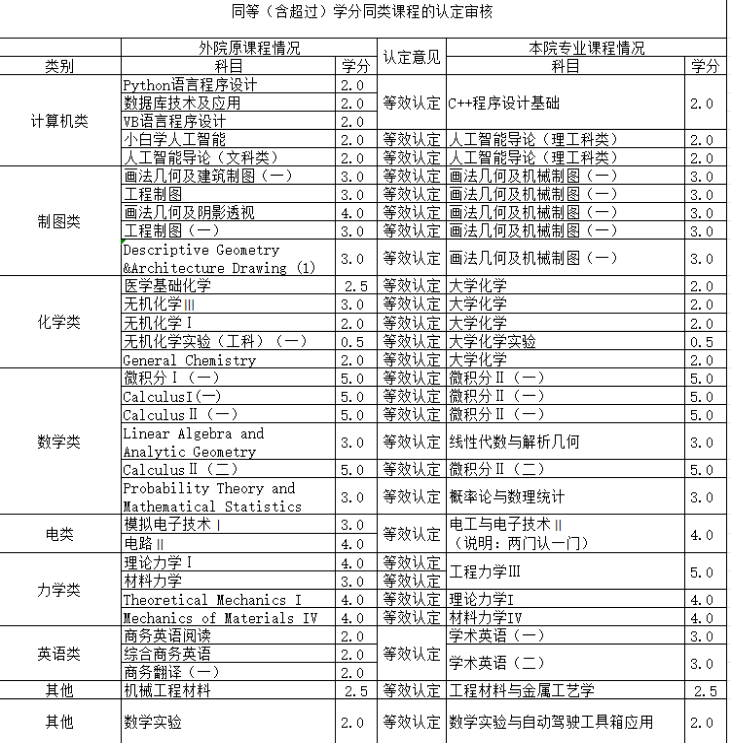

转机械个人经验帖及问题扫盲

2025级 机械电子工程 fish

转机械交流群：238483743

机械学院介绍及心路历程

华工机械学院中主要有三个专业 ：机械电子工程 机械工程
智能车辆工程（安工过控材控不是很了解），机械电子相比另外两个多了一些电类的课程，如电路数电模电，课程压力会大一点，如果想本科就业选机电，如果读研的话，三个专业差别不大，可以去官网看一下培养方案，计软自信电下面转专业最好的选择感觉就是机械，欢迎大家转入机械汽车与工程学院！

25级由于院士班分流大部分人选择了机械，院内分流，导致转专业政策收紧，和往年转专业形势大有所不同，要求高数≥90
英语≥85（相比24的门槛提高很多）导致门槛卡掉了很多人，报名人数都没有超过接受人数，我当时是觉得计软自信电太卷，然后很想逃离天坑专业，加上门槛提高导致竞争力不大，而且机械相比其他专业，会有很多比赛打，如RM
RC ACM 方程式 智能车 工训
电赛，学业压力不是很大，所以有更多的时间打比赛，在机械学院你可以学到一些实干的东西，做一名工程师，当然机械会有很多画图（可以上网搜一下机械工程制图）和力学，如材料力学理论力学，转之前也要想清楚自己能不能接受，有部分机械的同学也因为不喜欢画图或者学不懂力学转出的，总之转专业补课压力都不小，转之前和转之后都会很辛苦，转专业本来就是一次挑战，敢于挑战已经很棒啦！

转专业条件

四月份底会公布各院的转专业接收条件，可以在各学院官网看到，25年机械学院是比较晚的，出文件后就是五一假期，建议转专业的同学五一好好准备，机械因为是纯面试，所以了解你的渠道只有面试PPT和均分，大一上好好学习，卷一下数学和英语，无论是否转成功性价比都很高，如果均分不是很高，建议PPT里面放一些和机械有关的专业技能，如SW和AutoCAD（机械必会软件，有这两个也差不多了）当时我就是自学了SW，放了几张建模图片在PPT上，五一可以学一下SW，当然相关项目经历也可以，参加的一些比赛也可以放上去（如数竞
水赛也可以）。

关于转专业成功率

  专业           接收人数   报名人数   录取人数   平转人数   报录比
  -------------- ---------- ---------- ---------- ---------- --------
  机械电子工程   18         18         13         8          0.72
  机械工程       23         18         18         9          1
  智能车辆工程   18         5          3          3          0.6

综上来看，机工面试不会刷人，机电和车工都是宁缺毋滥，关于机械是否歧视文科和文科是否可以选择降转，25级机电是三个文科录了一个，车工没有文科报名，机工没有刷人，综上文科的同学足够优秀也可以报名机械，教务员当时说根据学分认定情况，学院决定是否降转，根据整个25级转专业文件，文科专业的同学没有平转的，所以如果想平转的文科专业同学，要慎重考虑。

  转入25级（无需降转的专业）                                  
  -------------------------------------- -------------------- ------
  转出专业                               转出学院             人数
  智慧交通                               土木与交通学院       6 人
  生物制药                               食品科学与工程学院   3 人
  能源化学工程                           轻工科学与工程学院   3 人
  食品科学与工程                         食品科学与工程学院   3 人
  船舶与海洋工程                         土木与交通学院       1 人
  生物工程                               食品科学与工程学院   1 人
  材料科学与工程                         材料科学与工程学院   1 人
  工程力学                               土木与交通学院       1 人
  生物技术                               生物科学与工程学院   1 人
  转入26级（需要降转的专业）                                  
  转出专业                               转出学院             人数
  工业设计                               设计学院             5 人
  行政管理                               公共管理学院         2 人
  商务英语                               外国语学院           2 人
  "城乡规划 + 大数据管理与应用" 双学位   建筑学院             1 人
  建筑学                                 建筑学院             1 人
  传播学                                 新闻与传播学院       1 人
  临床医学                               医学院               1 人
  旅游管理                               旅游管理系           1 人

（以上数据根据25转专业总名单统计，可能有同学主动选择降转，仅供参考）

转专业流程

在报名结束后，大概五一后会电话形式接到面试通知，稍后会在教务系统里面出面试公告（注意不是学院官网），进入转机械面试群后，面试前一天会抽签决定面试顺序以及用邮箱发面试PPT给教务老师，面试可能会比较早，早上八九点这样就开始了，所有人在一个教室等待，老师会叫人（有点类似叫号）

等待的过程会很煎熬，做好准备，但是也可以问前面同学老师问了什么，我当时是最后一个，面试顺序靠后除了等待得久，还是会打破一些信息差的，面试是5分钟自我介绍＋5分钟提问，屏幕上面会有计时器，不要超时，提问主要是根据PPT里面的内容，PPT不要乱写，不要吹水太多，每个细节都可能提问你，老师总体来说是比较和蔼的，可能会问一些比较难的问题，不要紧张，大大方方的就很好了，可劲怼老师（bushi）被问到能不能接受降转也不要紧张，工科没有降转的。

附面试PPT要求：其中个人陈述时间为 5 分钟，采用 PPT
讲述形式，内容主要包括个人及家庭基本情况、学业基本情况、申请转专业的理由及对申请专业的理解、今后的学业设想、个人的突出潜质、爱好及特长等，主要考核学生对申请专业的认知、学生的创新思维、对公共基础课程的掌握程度、学成学业的能力、将来从事本专业的意愿和志向、心理素质情况等。

面试可能提问的问题

机电面试问题：我当时第一个问题是能不能接受降转（语气很强硬给我吓到了QAQ）后面问了PPT上面的SW建模，问了减速箱的工作原理（这个有了解感觉老师还是很满意），以及我怎么建模的，后面问我有没有学一些编程，对带电的专业课有没有了解

据其他同学，问的还有 1.特征向量在机械方面的作用
2.怎么证明机械能守恒（联系微积分）3.数字电路和模拟电路有什么区别?各举一个机电系统中的例子4.线性代数与解析几何和微积分的区别5.大学物理力学
机械能
有关知识6.机械能是不是状态量7.有考虑过其他专业吗8.你为转入机电做了哪些准备

机工面试问题：1.PPT里面有一个超立方体，他针对我PPT问了一个问题。2.XX专业在华工的排名很靠前，为什么要来选机械专业？3.有没有做过一些什么机械相关项目4.线性代数有什么用5.为什么要转这个专业？6.如果你转这个专业是想做什么工作？

车工面试问题：1.为什么选择车辆工程?为什么不转自动化?

2.《理论力学》的研究对象?

3.汽车在制动过程中，是一下刹车刹死比较好，还是点剎比较好?

4.你觉得自己在原专业学习过程中，对转入智能车辆工程专业有哪些帮助?你原专业和智能车辆工程有哪些联系?

5.在车队实习的过程中，有做哪些工作?

（根据同学只言片语整理 不是很具体 仅供参考）

结语

转专业需要下定很大决心，付出很多努力，希望大一上和转专业之前你都能持续努力和坚定目标，无论成功与否，转到哪个专业，转专业都是一份挑战自己的经历与磨练，从中可以学到很多东西，以及总结反思自己的不足，后面无论在哪个专业，都需要继续卷卷卷，最后，祝各位转专业成功，欢迎转入机械与汽车工程学院！

（附机械学分认定表）

